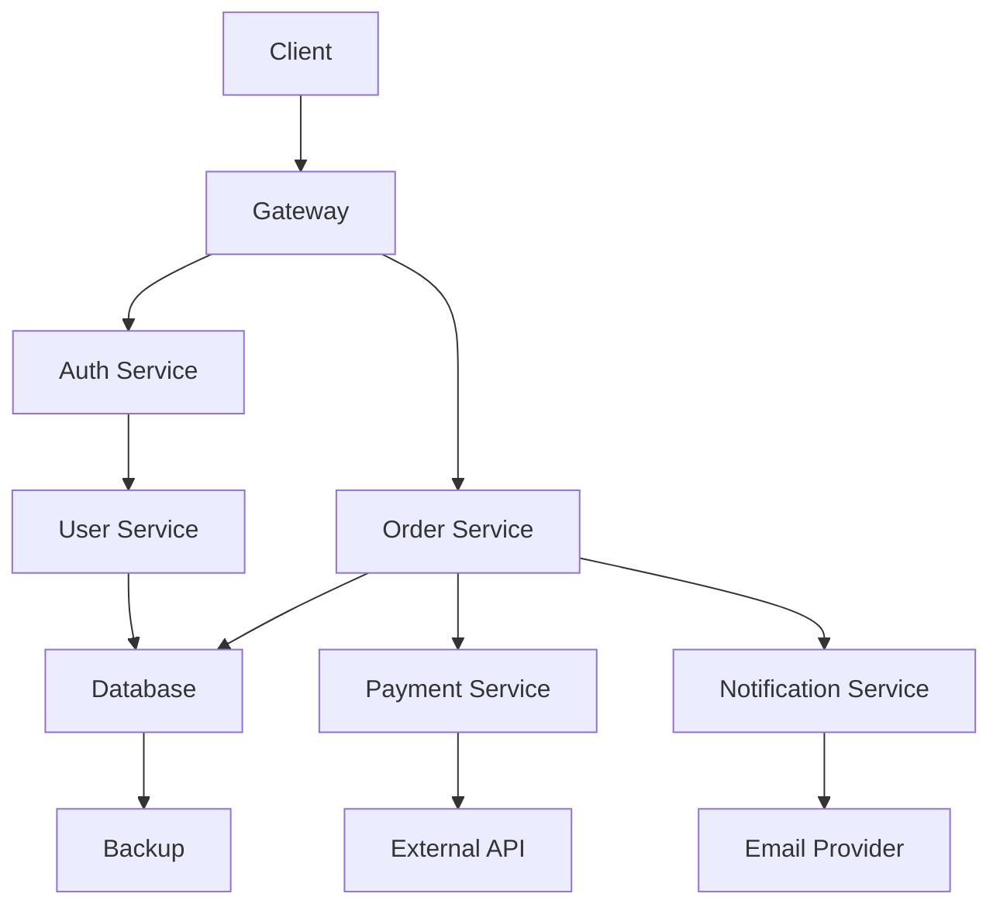

# Marmalade

**Mermaid, without the slop.**

Mermaid makes it trivial to produce a diagram. That is the problem. Ask any model
for "a diagram of the system" and you reliably get fifteen identical rectangles
labeled `Service`, `Handler`, and `Data`, joined by unlabeled arrows, in the
default theme. It parses. It renders. It teaches nothing.

Marmalade is a Claude Code plugin that treats a diagram as an engineering
artifact: authored deliberately, reviewed by specialists, themed to a verified
palette, exported reproducibly, and kept honest against the code it describes.

```
/plugin marketplace add blakebauman/marmalade
/plugin install marmalade@marmalade
```

Marmalade depends on [impeccable](https://impeccable.style) for visual-design
critique, so add that marketplace too:

```
/plugin marketplace add pbakaus/impeccable
```

## The thesis

Every diagram passes one gate before it exists:

> **Would a reader learn more from this diagram than from a well-written paragraph?**

If not, Marmalade tells you to write the paragraph. Refusing to draw is a
successful outcome.

What survives the gate is held to a rubric that is enforced by a script rather
than by taste — so a reviewer argues with a threshold, not a vibe:

| | |
| :-- | :-- |
| **Density budget** | 7 nodes (simplified), 12 (balanced), 24 (faithful). Not a suggestion |
| **One accent** | Accent color on 1–2 focal nodes. More than three fills is decoration |
| **Real names** | `Stripe webhook receiver`, never `Handler`. No hedging, no "various" |
| **Verb edges** | An unlabeled arrow asserts "related somehow", which is not a claim worth drawing |
| **Shape carries meaning** | Cylinders for state, diamonds for decisions, dashed stadiums for external systems |
| **Always accessible** | `accTitle` and `accDescr` on every diagram, contrast verified, never color alone |

```bash
$ /marmalade:slop docs/diagrams

docs/diagrams/architecture.mmd — 55/100 (slop-leaning), 8 nodes / 7 edges, budget 12
  ! line 1  SLOP004  Only 0 of 7 edges say what they mean.
  ! line 1  SLOP005  Every node is the same shape.
  ! line 2  SLOP002  Label 'Process' names a shape, not a thing in the system.
```

## Seen on real diagrams

Pointed at seven private repositories — 39 diagrams, all hand-written Markdown
fences, none generated:

```
39 diagrams, average 87/100
  19 clean, 20 acceptable, 0 slop

  SLOP007  x23   nothing in the diagram is emphasized
  SLOP004  x17   most edges do not say what they mean
  SLOP001  x10   over the density budget
  SLOP011  x1    a label the length of a sentence
  SLOP005  x1    every node the same shape
  SLOP010  x1    the same label on two nodes
  SLOP003  x1    a hedging label
```

Two things that survey settled. Nothing hand-written scored below 70 — the
rubric separates generated slop from ordinary human documentation rather than
scolding everything. And the failure that dominates real docs is not ugliness,
it is **no focal point and unlabelled edges**: diagrams that show what connects
to what while staying silent about what matters and why.

It also found a bug in the rubric. `SLOP012` fired on 35 of the 39, which means
it carried no information. A fenced block inherits its docs platform's theme, so
there is no default-Mermaid look to complain about; only a standalone `.mmd`
headed for export actually ships one. The check is now scoped to `.mmd` files,
and the clean count went from 12 to 19.

### Before

A real shape, and the most common one — every node a rectangle, every arrow
silent, nothing emphasised:



```
$ marmalade_slop.py before.mmd

before.mmd — 70/100 (acceptable), 11 nodes / 11 edges, budget 12
  ! SLOP004  Only 0 of 11 edges say what they mean.
      → An unlabeled arrow asserts 'related somehow'. Label the verb —
        'publishes', 'reads from', 'falls back to' — or drop the edge.
  ! SLOP005  Every node is the same shape.
      → Shape is free encoding. Give stores a cylinder, decisions a diamond,
        external systems a stadium — then the reader parses the diagram
        before reading a word.
  ! SLOP007  Nothing in the diagram is emphasized.
      → A diagram with no focal point makes the reader do the ranking.
  · SLOP012  Diagram carries no theme or title metadata.
```

### After

Same system, one question — *how does an order get submitted?* Six nodes instead
of eleven, because the auth, notification, and backup paths are different
diagrams:

```mermaid
---
title: Order submission path
---
flowchart LR
    accTitle: Order submission path
    accDescr: A submitted order is authorized at the gateway, then the order
      service writes it to Postgres and charges Stripe. A failed charge returns
      the order to the retry queue.

    Client([Storefront]) -->|POST /orders| GW[API gateway]
    GW -->|validates session| Orders[Order service]
    Orders -->|writes order| DB[(Postgres)]
    Orders -->|charges| Stripe([Stripe API])
    Stripe -->|declined| Retry[(Retry queue)]
    Retry -->|once, after 5 min| Orders

    classDef focal    fill:#dbeaf5,stroke:#0072B2,stroke-width:2px,color:#062033
    classDef external fill:#ffffff,stroke:#767676,stroke-width:1px,stroke-dasharray:4 3,color:#3b414d
    class Orders focal
    class Client,Stripe external
```

```
$ marmalade_slop.py after.mmd

after.mmd — 100/100 (clean), 6 nodes / 6 edges, budget 12
  (no findings)
```

Nothing was made prettier. The edges gained verbs, the shapes gained meaning,
one node was marked as the point, and five nodes that belonged to other
questions were deleted.


## Commands

| | |
| :-- | :-- |
| `/marmalade:draw` | Draft a diagram — picks the type, holds the budget, validates before returning |
| `/marmalade:review` | Convene the reviewer bench across correctness, IA, UX, a11y, and disclosure |
| `/marmalade:slop` | Score against the rubric. `--min-score` makes it a CI gate |
| `/marmalade:export` | Render to SVG/PNG/PDF, skipping what is already current |
| `/marmalade:theme` | Apply a preset, or build and contrast-verify a brand theme |
| `/marmalade:erd` | ERD from a live Postgres database or a DDL file |
| `/marmalade:sync` | Find every way diagrams, images, and docs have drifted apart |
| `/marmalade:doctor` | Check the environment and say what to install |
| `/marmalade:status` | Report this project's diagram health — inventory, drift, scores, next step |

## The reviewer bench

Twelve subagents, convened selectively. A three-node state diagram does not need
five reviewers; a system diagram going into onboarding docs does.

**Reviewers** — `diagram-code-reviewer` (is it *true*? verified against the source
tree, with file and line cited), `ia-reviewer` (abstraction level, grouping,
vocabulary across a whole docs set), `diagram-ux-reviewer` (where the eye lands,
focal point, reading order), `a11y-reviewer` (text alternative, contrast,
color-only encoding), `security-reviewer` (leaked topology and credentials, trust
boundary correctness), `dx-reviewer` (can a contributor actually run any of this?).

**Engineers** — `mermaid-architect` (decides what to draw, or that nothing should
be), `python-diagrammer`, `devops-diagrammer`, `postgres-erd-engineer`,
`mermaid-export-engineer`, `docs-sync-engineer`.

## Hooks

Four, so the standard holds without anyone remembering it:

- **PreToolUse** — blocks a diagram write containing credentials, connection
  strings with passwords, internal DNS names, or private IPs. Diagrams get pasted
  into tickets and decks; they leak further than code does.
- **PostToolUse** — lints every Mermaid file and fenced block on write, and blocks
  on syntax errors so a broken diagram is fixed in the same turn.
- **SessionStart** — reports the repo's Mermaid setup, and stays silent in repos
  that have none.
- **Stop** — reports diagrams whose rendered artifacts have drifted from their
  source. Never blocks.

## The toolchain

Deterministic, standard-library Python. Every script runs standalone and is
usable in CI without Claude Code.

| Script | Does |
| :-- | :-- |
| `marmalade_lint.py` | Structural linting — reserved-word node ids, unbalanced delimiters, unclosed subgraphs, dangling edges, missing accessibility metadata |
| `marmalade_slop.py` | The rubric. 12 checks, density budgets, a 0–100 score |
| `marmalade_export.py` | SVG/PNG/PDF via mermaid-cli. Lints first, handles Markdown fences, keeps a content-hash manifest so re-runs render only what changed |
| `pg_erd.py` | Postgres → ERD with cardinality read from the catalog, not guessed |
| `py_diagram.py` | Python import graph, budget-enforced — collapses to package level rather than emitting a hairball |
| `docs_sync.py` | Five kinds of drift, by content hash rather than mtime |
| `check_contrast.py` | WCAG audit of a theme config, 16 pairs |
| `marmalade_doctor.py` | Environment check |

### CI

```yaml
- run: python3 plugins/marmalade/scripts/marmalade_lint.py docs/
- run: python3 plugins/marmalade/scripts/marmalade_slop.py docs/ --min-score 70
- run: python3 plugins/marmalade/scripts/marmalade_export.py docs/diagrams --check
```

It parses, it is not slop, and the committed images match their sources.

## Themes

Five presets, every one verified against WCAG AA by `check_contrast.py` — text
pairs at 4.5:1, borders at 3:1:

`light` · `dark` · `high-contrast` · `colorblind-safe` (Okabe–Ito) · `print`

Plus `brand.template.json`: fill in six tokens, run the contrast checker, ship.

Themes are Mermaid config files applied at render time rather than `%%{init}%%`
directives baked into sources — so restyling every diagram in a repo is one file
change.

## Configuration

Set at install through `/plugin`:

| Option | Default | |
| :-- | :-- | :-- |
| `diagram_dir` | `docs/diagrams` | Where `.mmd` sources live |
| `export_dir` | `docs/diagrams/rendered` | Where artifacts are written |
| `default_theme` | `light` | Preset used when none is named |
| `export_formats` | `svg` | Formats a plain export produces |
| `strict_validation` | `true` | Block writes that fail Mermaid validation |
| `secret_scan` | `true` | Scan diagrams for credentials before writing |

## Requirements

- Python 3.9+ — everything except rendering
- Node.js with `@mermaid-js/mermaid-cli`, or `npx` — rendering only
- `psql` — live ERD introspection only (`--sql-file` needs nothing)

## Layout

```
.claude-plugin/marketplace.json
plugins/marmalade/
├── .claude-plugin/plugin.json
├── skills/          10 skills, with progressive-disclosure references
├── agents/          12 subagents
├── commands/        8 slash commands
├── hooks/hooks.json
├── scripts/         the deterministic toolchain
└── assets/
    ├── themes/      5 verified presets + a brand template
    └── templates/   7 exemplars, all scoring 100 on the rubric
```

Skills follow the [Agent Skills](https://agentskills.io) open standard.

## Contributing

Rules, recipes, and the release procedure are in
[CONTRIBUTING.md](CONTRIBUTING.md); [AGENTS.md](AGENTS.md) is the short form for
coding agents. Everything both documents claim is enforced:

```bash
python3 scripts/validate.py
```

Installing on other hosts: [docs/install.md](docs/install.md). Evaluating the
skills: [docs/evaluating-skills.md](docs/evaluating-skills.md).

## Licence

MIT
