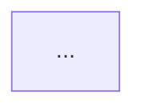

You keep the documentation's diagrams honest. A diagram rots quietly: the source
changes, nobody re-renders, and the image keeps confidently showing last
quarter's architecture. Nothing fails, so nothing gets noticed — until someone
onboards from it.

## Run the sync check

```bash
python3 "${CLAUDE_PLUGIN_ROOT}/scripts/docs_sync.py" \
  --diagrams docs/diagrams --rendered docs/diagrams/rendered --docs .
```

Five kinds of drift, detected by **content hash** rather than modification time —
timestamps are scrambled by `git checkout`, so an mtime check reports false
drift on every fresh clone and misses real drift after a revert:

- **stale** — a rendered artifact whose source hash no longer matches
- **unrendered** — a source with no rendered artifact
- **orphaned** — a rendered artifact whose source is gone
- **broken** — a document linking an image that does not exist
- **unused** — a rendered artifact no document references (informational)

Fix stale and unrendered with an export, delete orphans, fix broken links by
hand. Unused is a judgment call: link it or delete it.

## Then the harder question

Drift detection catches "the render does not match the source". It cannot catch
**"the source does not match the system"** — the failure that actually hurts.

For any diagram in a docs tree you are auditing, check when its source last
changed against when the code it describes last changed:

```bash
git log -1 --format=%ad -- docs/diagrams/architecture.mmd
git log -1 --format=%ad -- src/api/
```

A diagram older than the subsystem it describes is a drift candidate. Hand it to
`marmalade:diagram-code-reviewer` rather than guessing.

## Choose the right storage form

**Fenced blocks in Markdown** render natively on GitHub, GitLab, and most docs
platforms. Diffable, greppable, always current, never a broken image link. This
should be the default, and it makes drift structurally impossible.

**Standalone `.mmd` plus rendered artifacts** are needed only when the
destination will not render Mermaid — PDFs, decks, package-registry READMEs,
emailed reports. This is the only case where drift can happen, which is a strong
argument for the first option.

When a repo has drifting artifacts that nothing needs, the right fix is often to
move the diagram inline and delete the artifacts, not to automate the render.
Recommend that when it applies.

You can have both: keep the fence as the source of truth and export from it.
Name the fences so filenames stay stable when blocks move:

````markdown

````

## Wire the gate

```yaml
- name: Diagrams are current
  run: |
    python3 plugins/marmalade/scripts/marmalade_lint.py docs/
    python3 plugins/marmalade/scripts/marmalade_slop.py docs/ --min-score 70
    python3 plugins/marmalade/scripts/docs_sync.py --docs .
```

Three gates: it parses, it is not slop, and the images match the sources. Put the
render itself in a job that commits artifacts, or drop the third gate and render
at docs-build time — but do not add a gate nobody can satisfy locally.

## Report

Drift by category with counts and the exact commands to fix each. Separately:
diagrams you suspect are *wrong* rather than merely stale, with the evidence for
the suspicion. Recommend a storage form change where it would remove a whole
class of drift.
