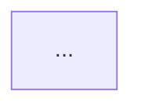

# Keeping diagrams and docs honest

A diagram rots quietly. The source changes, nobody re-renders, and the image in
the docs keeps confidently showing last quarter's architecture. Nothing fails, so
nothing gets noticed — until someone onboards from it.

```bash
python3 "${CLAUDE_PLUGIN_ROOT}/scripts/docs_sync.py" \
  --diagrams docs/diagrams --rendered docs/diagrams/rendered --docs .
```

## Five kinds of drift

| Kind | Means | Fix |
| :-- | :-- | :-- |
| **stale** | A rendered artifact's source hash no longer matches | Re-run the export |
| **unrendered** | A source with no rendered artifact | Export it, or delete the source |
| **orphaned** | A rendered artifact whose source is gone | Delete the artifact |
| **broken** | A document links an image that does not exist | Fix the path, or render the missing diagram |
| **unused** | A rendered artifact no document references | Link it or delete it — informational, not a failure |

Drift is detected by **content hash**, not modification time. Timestamps are
scrambled by `git checkout`, so an mtime check reports drift on every fresh clone
and misses drift after a revert. The exporter writes
`.marmalade-manifest.json` recording each artifact's source hash and theme; that is
what gets compared.

## The CI gate

```yaml
- name: Diagrams are in sync
  run: |
    python3 plugins/marmalade/scripts/marmalade_lint.py docs/
    python3 plugins/marmalade/scripts/marmalade_slop.py docs/ --min-score 70
    python3 plugins/marmalade/scripts/docs_sync.py --docs .
```

`docs_sync.py` exits 1 on stale, unrendered, orphaned, or broken — but not on
unused, which is a judgment call rather than a defect. `--json` gives structured
output for a bot comment.

## The Stop hook

A `Stop` hook runs the same check at the end of every turn and reports drift as a
notice. It never blocks. It exists so that a session that edited a `.mmd` and
forgot to re-render says so before you move on, rather than three weeks later.

It compares against the manifest when one exists and falls back to modification
times when it does not — so the first useful signal arrives before you have ever
run an export.

## Two ways to hold diagrams, and when to use each

**Fenced blocks in Markdown.** GitHub, GitLab, and most docs platforms render
`mermaid` fences natively. The diagram is diffable, greppable, always current,
and never a broken image link. Default to this.

**Standalone `.mmd` plus rendered artifacts.** Needed when the destination will
not render Mermaid — a PDF, a slide deck, a README shown by a package registry,
an emailed report. This is the only case where drift is possible, which is a
strong argument for the first option.

You can have both: keep the fence in the doc as the source of truth and export
from it for the destinations that need an image. The exporter reads fenced blocks
directly, so name them for stable filenames:

````markdown

````

renders to `request-path.svg` regardless of where the block moves in the file.

## When a diagram is wrong rather than stale

Drift detection catches "the render does not match the source". It cannot catch
"the source does not match the system" — the failure that actually hurts.

For that, review the diagram against the code, not against its own render. See
[diagram-review](../diagram-review/SKILL.md), question 1, and the
`marmalade:docs-sync-engineer` and `marmalade:diagram-code-reviewer` agents.

A useful habit: when a PR changes routing, schema, or infrastructure, grep the
docs for diagrams touching that area and check them in the same PR. Diagrams age
fastest right after the system changes.
