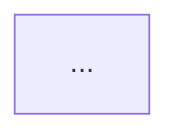

# Exporting Mermaid

```bash
python3 "${CLAUDE_PLUGIN_ROOT}/scripts/marmalade_export.py" docs/diagrams \
  --format svg,png --theme light --out docs/diagrams/rendered
```

That renders every `.mmd` file and every `mermaid` block under `docs/diagrams`,
skips anything already current, and writes a manifest so the next run knows what
changed.

## What the exporter does that raw `mmdc` does not

- **Lints first.** A diagram with a syntax error never reaches the renderer;
  you get the line number instead of a broken image. `--force` overrides.
- **Handles Markdown.** Fenced `mermaid` blocks are extracted and rendered
  individually, named from a fence `id=` attribute, a frontmatter `title`, or
  the document stem plus an index.
- **Content-hash manifest.** `.marmalade-manifest.json` in the output directory
  records each artifact's source hash and theme, so re-running renders only what
  actually changed — and drift is detected by content, not by timestamps that
  a `git checkout` scrambles.
- **Falls back to npx.** Uses `mmdc` if installed, otherwise
  `npx -y -p @mermaid-js/mermaid-cli mmdc`.

## Naming a diagram inside Markdown

````markdown

````

renders to `checkout-flow.svg`. Without an `id`, a document with one block uses
the document stem; multiple blocks get `-1`, `-2` suffixes, which are stable only
as long as block order is. Name anything you intend to link to.

## Format choice

| Format | Use for | Watch out |
| :-- | :-- | :-- |
| **SVG** | Docs sites, READMEs, anything on the web | Text stays selectable and searchable; fonts must exist on the viewer's machine unless embedded |
| **PNG** | Slides, chat, GitHub issue bodies, anywhere SVG is stripped | Rasterized — export at `--scale 2` or `3` |
| **PDF** | Print, formal documents | Vector, but no responsive sizing |

Default to SVG. Add PNG when a destination strips SVG (many chat clients and
some CMSs do).

## Common invocations

```bash
# One file, dark theme
python3 .../marmalade_export.py docs/diagrams/architecture.mmd --theme dark

# Everything, both light and dark, into separate directories
python3 .../marmalade_export.py docs/ --theme light --out docs/rendered/light
python3 .../marmalade_export.py docs/ --theme dark  --out docs/rendered/dark

# High-DPI PNG for a deck
python3 .../marmalade_export.py docs/diagrams --format png --scale 3 --width 1600

# Transparent background
python3 .../marmalade_export.py docs/diagrams --background transparent

# CI: fail if anything is out of date, render nothing
python3 .../marmalade_export.py docs/diagrams --check
```

`--check` exits 1 when any artifact is stale, which makes it a drop-in CI gate.
`--json` gives machine-readable output for scripting.

## Wiring into CI

```yaml
- name: Diagrams are current
  run: |
    python3 plugins/marmalade/scripts/marmalade_lint.py docs/diagrams
    python3 plugins/marmalade/scripts/marmalade_slop.py docs/diagrams --min-score 70
    python3 plugins/marmalade/scripts/marmalade_export.py docs/diagrams --check
```

Three gates: it parses, it is not slop, and the committed images match the
sources. Run the render itself in a job that commits the artifacts, or drop the
third gate and render at docs-build time.

In a container, Chromium usually needs a sandbox flag:

```bash
cat > puppeteer.json <<'JSON'
{ "args": ["--no-sandbox", "--disable-setuid-sandbox"] }
JSON
python3 .../marmalade_export.py docs/diagrams --puppeteer-config puppeteer.json
```

## Fonts

`mmdc` renders in headless Chromium, so a font must be installed on the machine
doing the rendering — not on the reader's. If a brand font is missing, Chromium
silently substitutes and the output looks subtly wrong. Either install the font
in the render environment, or set a `fontFamily` stack whose first available
entry is the one you want.

## When rendering fails

Run `python3 "${CLAUDE_PLUGIN_ROOT}/scripts/marmalade_doctor.py"` first — it
reports whether a renderer is reachable, which presets are present, and where
the configured directories point.

- *No renderer available* — install `@mermaid-js/mermaid-cli`, or make `npx`
  reachable.
- *Timed out* — the first `npx` run downloads Chromium. Install `mmdc` globally
  to avoid paying that repeatedly.
- *Rendered but empty* — almost always a diagram that lints clean but uses beta
  syntax the installed Mermaid version does not know. Check the Mermaid version.

Related: [mermaid-theming](../mermaid-theming/SKILL.md) for the presets,
[docs-diagram-sync](../docs-diagram-sync/SKILL.md) for keeping docs honest.
